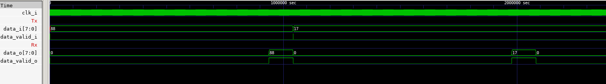

 

# Universal Asynchronous Receiver-Transmitter (UART)

Universal Asynchronous Receiver-Transmitter (UART) is a commonly used serial data transmission protocol.

(*Source : [Wikipedia](https://en.wikipedia.org/wiki/Universal_asynchronous_receiver-transmitter)*)

## Implementation
This repository contains RTL implementation of 8-bit UART, written in system-verilog. Implementation is mainly divided into four major modules or blocks, baud rate generator, transmitted and receiver modules, respectively.

## Design Parameters
- Clock freq (fclk) = 20 MHz
- Baud Rate (Bd) = 9600 bits/s
- Oversampling = 16 
  
    Therefore, 

- $Baud Divisor = \frac{20}{16*9600} ≈ 130$
- Start bit (HIGH) : Tx line kept high in idle state.
- Stop bit (HIGH) : Additional bit (Boolean 1) is augmented after the data.
- No parity bits.

    Fig 1:  Transmitting and receiving two 8-bit values (8'd88 & 8'd17) using 8-bit UART interface.
    

